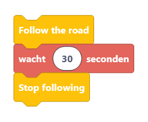

Following a lane
================

This is an example for how to get the Mirte robot drive around in Duckietown only following the lane.
The example is made for Blockly, Python-simple and Python-hard.
The example follows the lane in Duckietown for 30 seconds.

.. tabs::

    .. group-tab:: Blockly

        |pic_duck_1|

    .. group-tab:: Python-simple

        .. code-block:: python

            from mirte_robot import robot
            mirte=robot.createRobot()
            from mirte_duckietown import duckietown
            camera=duckietown.createCamera(mirte)
            import time

            # this makes the Mirte bot follow the line for 30 seconds
            camera.startFollowing()
            time.sleep(30)
            camera.stopFollowing()

    .. group-tab:: Python-hard 

        .. code-block:: python 

            print("placeholder")

