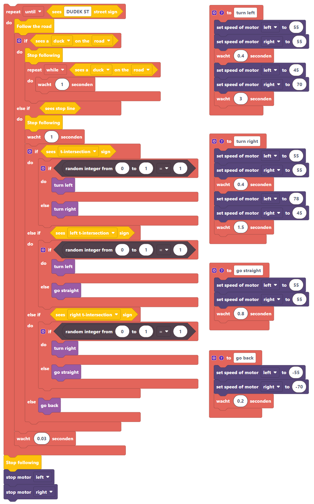

===========
One example
===========

This will show two examples for driving around in Duckietown. 
One example will be very simple while the other one is more complicated.

++++++++++++++
Simple example
++++++++++++++

This example does the following:

#. Start following the road
#. When it sees a stop-line permanently stop following

.. tabs:: 

    .. group-tab:: Blockly

        |pic-duck-1|
    
    .. group-tab:: Python-simple

        .. code-block:: python 

            from mirte_robot import robot
            mirte=robot.createRobot()
            from mirte_duckietown import duckietown
            camera=duckietown.createCamera(mirte)
            import time

            camera.startFollowing()
            wait_cond = (camera.seesStopLine())
            while not(wait_cond):
                time.sleep(.1)
                wait_cond = (camera.seesStopLine())
            camera.stopFollowing()

+++++++++++++++++++
Complicated example
+++++++++++++++++++

This code does a lot and it contains something of everything. In short it does the following:

#. Start following the lane
#. If a stop line is detected stop for 1 second and do the following based on the road sign detected:

    #. If it is a T-intersection to the left randomly choose between going strait or left then follow the lane again
    #. If it is a T-intersection to the right randomly choose between going strait or to the right then follow the lane again
    #. If it is a T-intersection where going strait is not an option randomly choose between going left or right then follow the lane again
    #. If no sign is detected back up start following the lane again
#. If a Duck is detected stop lane following and on start following the lane again once the Duck is no longer detected
#. If a street sign with the name DUDEK ST is detected permanently stop following the lane

**Important Notice: To make this example work you might have to change the speed of the motor a bit for turing left and right**

.. tabs:: 

    .. group-tab:: Blockly

        |pic-duck-2|

    .. group-tab:: Python-simple

        .. code-block:: python

            from mirte_robot import robot
            mirte=robot.createRobot()
            from mirte_duckietown import duckietown
            camera=duckietown.createCamera(mirte)
            from mirte_duckietown.object import Object
            import time
            from mirte_duckietown.sign import Sign
            import random

            # Makes Mirte turn left
            def turn_left():
                mirte.setMotorSpeed('left', 55)
                mirte.setMotorSpeed('right', 55)
                time.sleep(0.4)
                mirte.setMotorSpeed('left', 45)
                mirte.setMotorSpeed('right', 70)
                time.sleep(3)

            # Makes Mirte turn right
            def turn_right():
                mirte.setMotorSpeed('left', 55)
                mirte.setMotorSpeed('right', 55)
                time.sleep(0.4)
                mirte.setMotorSpeed('left', 78)
                mirte.setMotorSpeed('right', 45)
                time.sleep(1.5)

            # Makes Mirte go straight
            def go_straight():
                mirte.setMotorSpeed('left', 55)
                mirte.setMotorSpeed('right', 55)
                time.sleep(0.8)

            # Makes Mirte go backwards
            def go_back():
                mirte.setMotorSpeed('left', (-55))
                mirte.setMotorSpeed('right', (-70))
                time.sleep(0.2)

            while not (camera.seesStreet("DUDEK ST")):
                camera.startFollowing()
                if camera.seesObstacleOnLane(Object.DUCK):
                    camera.stopFollowing()
                    while camera.seesObstacleOnLane(Object.DUCK):
                        time.sleep(1)
                elif camera.seesStopLine():
                    camera.stopFollowing()
                    time.sleep(1)
                    if camera.seesSign(Sign.T_INTERSECTION):
                        if random.randint(0, 1) == 1:
                            turn_left()
                        else:
                            turn_right()
                    elif camera.seesSign(Sign.LEFT_T_INTERSECT):
                        if random.randint(0, 1) == 1:
                            turn_left()
                        else:
                            go_straight()
                    elif camera.seesSign(Sign.RIGHT_T_INTERSECT):
                        if random.randint(0, 1) == 1:
                            turn_right()
                        else:
                            go_straight()
                    else:
                        go_back()
                time.sleep(0.03)
            camera.stopFollowing()
            mirte.setMotorSpeed('left', 0)
            mirte.setMotorSpeed('right', 0)

